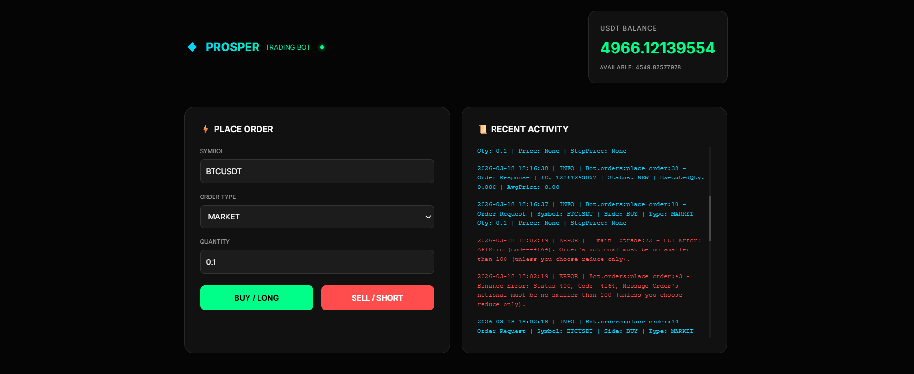
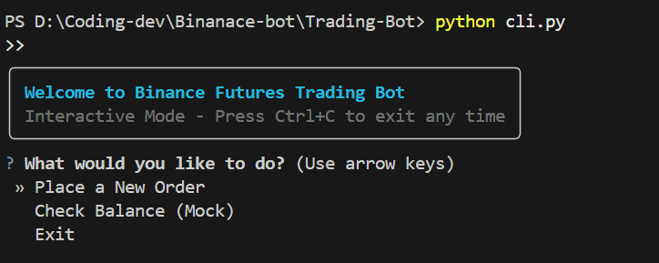
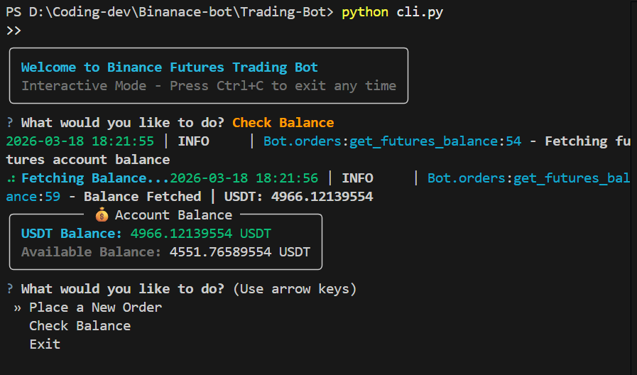
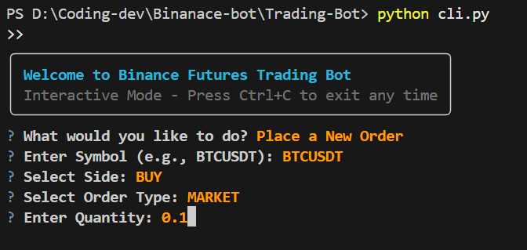
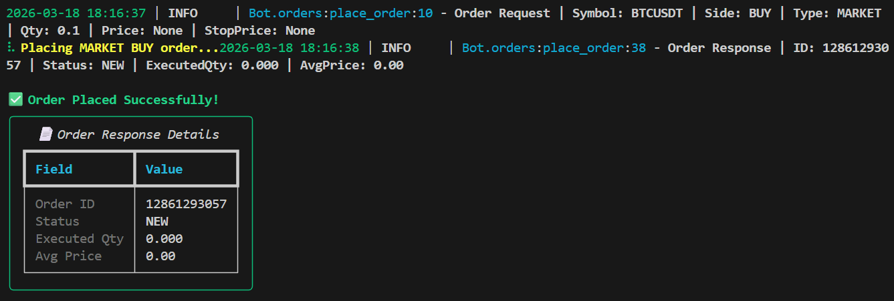

# Binance Futures Trading Bot (Testnet)

A robust Python CLI tool and Web Dashboard for placing orders on the Binance Futures Testnet (USDT-M) with enhanced UI, logging, and error handling.



## Features
- **Web Dashboard**: real-time balance and log streaming.
- **Interactive CLI Mode**: User-friendly menu-driven interface for multiple orders.
- **CLI UI**: Premium CLI experience using `Rich` and `Questionary`.
- **Order Types**: Support for `MARKET`, `LIMIT`, and `STOP_MARKET`.
- **Sides**: `BUY` and `SELL`.
- **Logging**: Comprehensive logging of API requests, responses, and errors to `logs/trading.log`.
- **Validation**: Robust input validation for symbol, side, and order-specific parameters.

## Setup Instructions

### 1. Prerequisites
- Python 3.8+
- Binance Futures Testnet API Key and Secret Key.

### 2. Installation
Install Python dependencies:
```bash
cd Trading-Bot
pip install -r requirements.txt
```

Install Frontend dependencies:
```bash
cd client
npm install
```

### 3. Environment Configuration
Create a `.env` file in the `Trading-Bot/` directory and add your credentials:
```env
BINANCE_API_KEY=your_testnet_api_key
BINANCE_SECRET_KEY=your_testnet_secret_key
# BASE_URL=https://testnet.binancefuture.com
```

---

## How to Run

### 🌐 Web Dashboard 
To run the web interface, you need to start both the backend API and the frontend client.

1. **Start Backend API**:
   ```bash
   cd Trading-Bot
   uv init
   uv venv
   # On Windows:
   .venv\Scripts\activate
   # Then install and run:
   uv pip install -r requirements.txt
   python api.py
   ```
2. **Start Frontend Client**:
   ```bash
   cd client
   npm install
   npm run dev
   ```
   Open [http://localhost:5173](http://localhost:5173) in your browser.

### 💻 Interactive CLI Mode
Simply run the script from the `Trading-Bot` directory. It will guide you through the process and stay open until you choose to exit.
```bash
cd Trading-Bot
python cli.py
```

---

## Preview

### Interactive Menu


### Check Balance


### Placing an Order


### Success Confirmation


## Implementation Details
- **Frontend**: Built with React (Vite) and tailwind CSS for a premium, dark-themed experience.
- **Backend API**: FastAPI bridge to core trading logic.
- **Logging**: Powered by `loguru`. Logs are stored in the `logs/` directory.
- **Error Handling**: Handles Binance API exceptions and invalid user inputs with clear feedback.

## Important Notes
- Symbols should be provided in standard Binance format (e.g., `BTCUSDT`).
- Quantity and Price must be valid for the specific symbol's filters (notional >= 5.0, etc.).

---

## 🚀 Happy Coding! 💻

Made with ❤️ by Dhrup